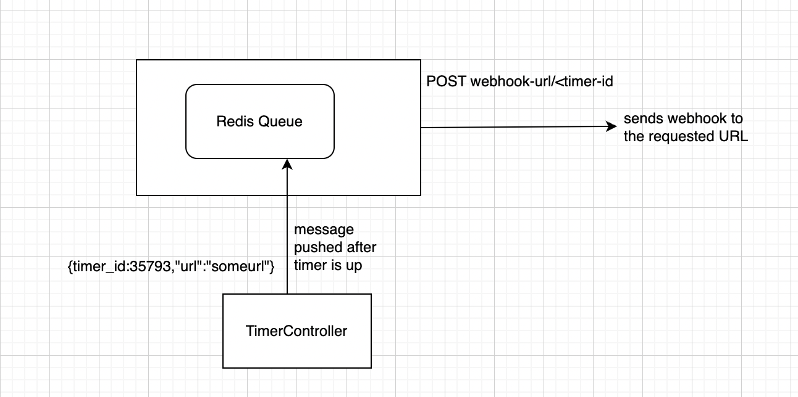

## General info
This project is a Timer App. It offers 2 API's:
* Set Timer : POST /timers
  * Endpoint: http://127.0.0.1:105/timers/
  * Request body:
    ```
    {
        "hours":10,
        "minutes":30,
        "seconds":22,
        "url":<anyurl>
    }
    ```
  * Response body:
    ```
    {
        "id": <timer-id>
    }
    ```
* Get Timer: GET /timers/43623
  * Endpoint: http://127.0.0.1:105/timers/<timer-id>
  * Response Body:
    ```
    {
        "id": 43623,
        "time_left": 345
    }
    ```
	
## Technologies
Project is created with:
* Python version: 3.8
* Redis: 3.11 (as a persistent storage)

	
## Pre-requisites:
1. Install Python
2. Setup Redis

## Clone Repo:
```
git clone https://github.com/nidhij23/timer_assignment.git
```

## Setup
To run this project, install it locally using :
1. Create a new virtualenv
    ```
    pip install virtualenv
    cd /timer-assignment
    virtualenv venv
    source venv/bin/activate
    ```
2. Install required packages for the project
    ```
    pip install requirements.txt
   ```
3. In the terminal, Start the Redis Server
   ```
    redis-server
   ```
4. Open a new terminal tab, start the redis worker
   ```
    export OBJC_DISABLE_INITIALIZE_FORK_SAFETY=YES
    python src/Worker.py
   ```
5. Open a third terminal tab, start the API controller
    ```
   python src/TimerController.py
    ```

## High Level Design:
### Set Timer Workflow:

When the setTimer POST API is hit, a new python process gets spawned which
runs which does below tasks:
1. calculates the total timer duration in seconds
2. Prepares a new message which would be pushed into the redis queue with a delay which is equal to the 
duration.
3. Creates a new entry in the redis with key as the id, value as the url given in request body and ttl equal to the duration.


### Get Timer Workflow:


The Get Timer GET API does the below:
1. It checks the redis if it has the id as one of the key.
2. If it contains the key it return the ttl of the key as the time_left.
3. If the key is not found, it returns 404 Not found.

### WebHook Generation Workflow:

Below tasks happen when webhook is generated.
1. Once the delay of the message is reached, the message gets queued in the redis queue and the webhook gets sent.
2. The key of the timer-id is deleted from redis.

### Requeue worker( to pick dangling timers in case of server restart):

There is a chance that the server might get restarted while some timers were in progress. To handle this, the keys have been persisted in the
redis with ttl and once the server is restarted it calls the requeue_jobs method and requeus all keys with their ttl.
The keys already get deleted for the completed timers, so only the pending once remain.
 For the timers which got completed when the server was down, the ttl would be -1, for these we set the delay as 0 and thus their webhook gets called immediately.

### Scaling the system:
Right now I have used only one queue in this project but to scale it to handle more number if requests,
more number of queues need to be added, which can be picked based on some algorithm(least busy queue).


