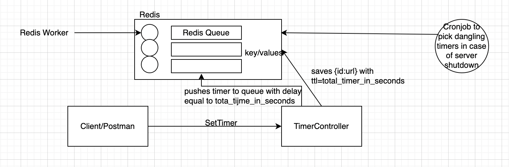
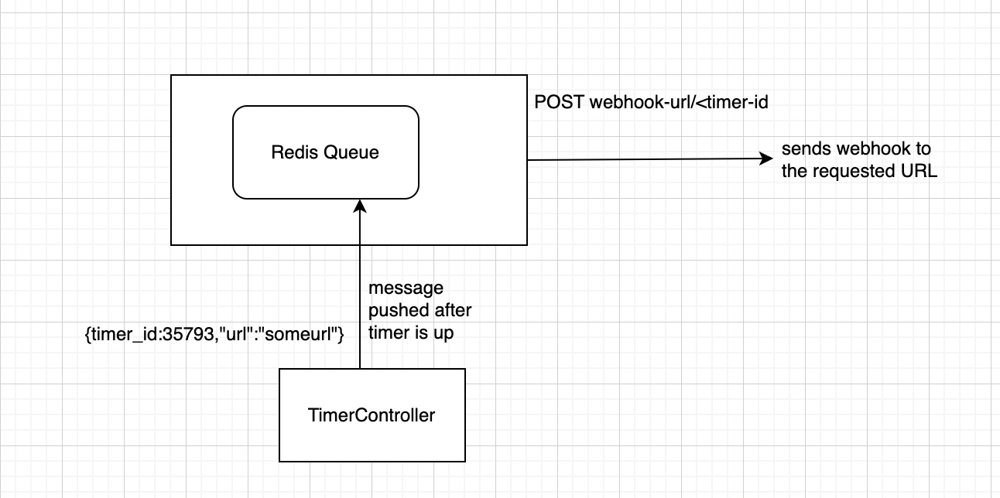
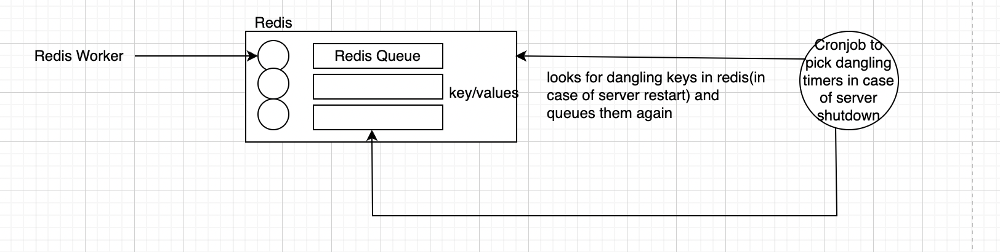

## Table of contents


## General info
This project is a Timer App. It offers 2 API's:
* Set Timer : POST /timers
  * Endpoint: http://127.0.0.1:105/timers/
  * Request body:
    ```
    {
        "hours":10,
        "minutes":30,
        "seconds":22,
        "url":<anyurl>
    }
    ```
  * Response body:
    ```
    {
        "id": <timer-id>
    }
    ```
* Get Timer: GET /timers/43623
  * Endpoint: http://127.0.0.1:105/timers/<timer-id>
  * Response Body:
    ```
    {
        "id": 43623,
        "time_left": 345
    }
    ```
	
## Technologies
Project is created with:
* Python version: 3.8
* Redis: 3.11 (as a persistent storage)

	
## Pre-requisites:
1. Install Python
2. Setup Redis

## Clone Repo:
```
git clone https://github.com/nidhij23/timer_assignment.git
```

## Setup
To run this project, install it locally using :
1. Create a new virtualenv
    ```
    pip install virtualenv
    cd /timer-assignment
    virtualenv venv
    source venv/bin/activate
    ```
2. Install required packages for the project
    ```
    pip install requirements.txt
   ```
3. In the terminal, Start the Redis Server
   ```
    redis-server
   ```
4. Open a new terminal tab, start the redis worker
   ```
    export OBJC_DISABLE_INITIALIZE_FORK_SAFETY=YES
    python src/Worker.py
   ```
5. Open a third terminal tab, start the API controller
    ```
   python src/TimerController.py
    ```

## High Level Design:
Set Timer Workflow:


Get Timer Workflow:


WebHook Generation Workflow:


Scheduled Cronjob( to pick lost timers in case of server restart):



